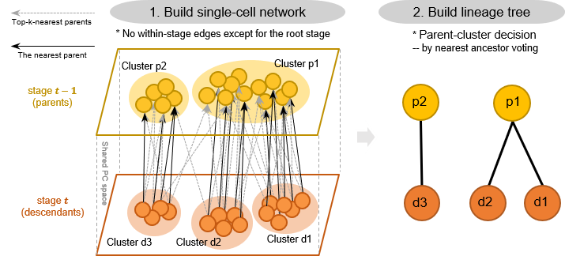

stagewiseNN
===========

**stagewiseNN** is a computational tool for constructing
developmental tree from Multi-staged single-cell RNA-seq data.

(see [StagewiseNN Documentation ](https://xingyanliu.github.io/stagewiseNN/index.html) for detailed guides)

It starts from building a single-cell graph by connecting each cell to its
k-nearest neighbors in the parent stage, followed by voting-based tree-construction
and adaptive cluster refinement.



It is easy to use:

```python
import swnn

# ====== Inputs ======
# data_matrix = ..
# stage_labels = ..
# group_labels = ..
# stage_order = [f'stage_{i}' for i in range(5)]

builder = swnn.Builder(stage_order=stage_order)
# step 1:
# building (stage-wise) single-cell graph
distmat, connect = builder.build_graph(
        X=data_matrix, stage_lbs=stage_labels,
    )
# step 2:
# build developmental tree from single-cell graph
builder.build_tree(group_labels, stage_labels,)
```


Installation
------------

Requirements:

- python >= 3.6
- [scanpy](https://pypi.org/project/scanpy/)
- [scikit-learn](https://pypi.org/project/scikit-learn/)


Install stagewiseNN by running (in the command line):

```shell
pip install swnn
```

or install from source code:

```shell
git clone https://github.com/zhanglabtools/stagewiseNN.git
cd stagewiseNN
python setup.py install
```

Contribute
----------

- Issue Tracker: https://github.com/XingyanLiu/stagewiseNN/issues
- Source Code: 
  - https://github.com/zhanglabtools/stagewiseNN
  - https://github.com/XingyanLiu/stagewiseNN (the developmental version)

Support
-------

If you are having issues, please let us know.
We have a mailing list located at: 

* xingyan@amss.ac.cn
* 544568643@qq.com

Citation
--------
If you find StagewiseNN helps, Please cite:

> Pengcheng Ma, Xingyan Liu, Zaoxu Xu et al. 
> **Joint profiling of gene expression and chromatin accessibility of amphioxus 
> development at single cell resolution**, 18 May 2021, PREPRINT (Version 1) available at Research Square [https://doi.org/10.21203/rs.3.rs-504113/v1]
