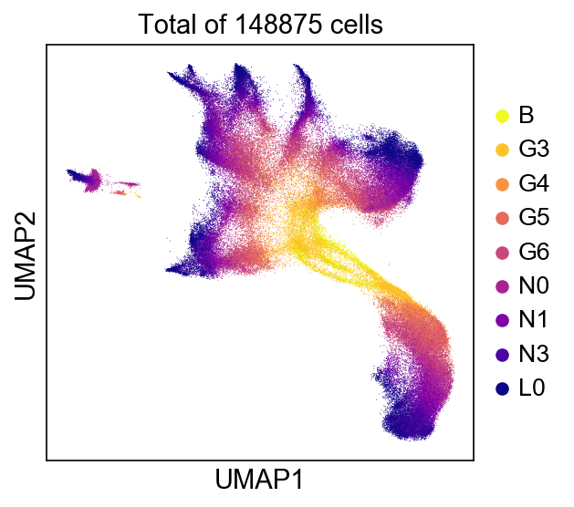
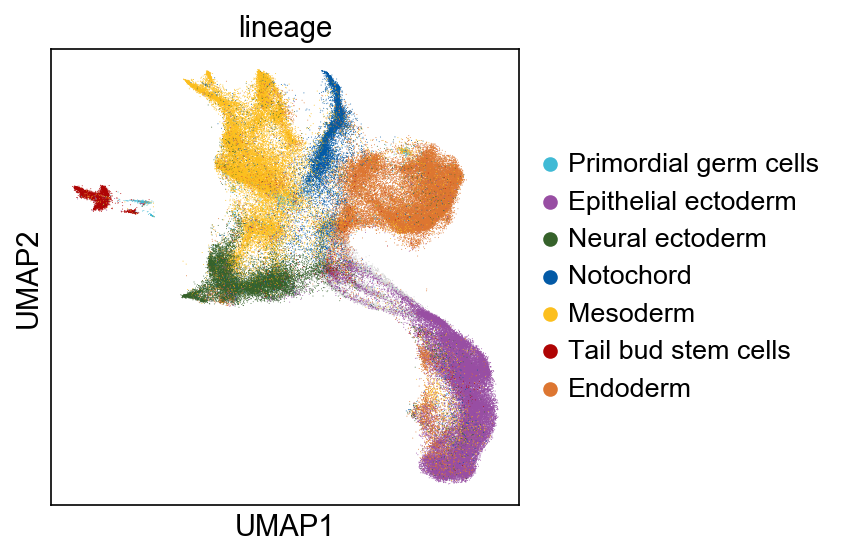

.. stagewiseNN documentation master file, created by
   sphinx-quickstart on Mon Jul 19 12:54:30 2021.
   You can adapt this file completely to your liking, but it should at least
   contain the root `toctree` directive.

stagewiseNN - Building developmental tree from scRNA-seq
========================================================

**stagewiseNN** is a computational tool for constructing
developmental (lineage) tree from Multi-staged single-cell RNA-seq data.

It starts from building a single-cell graph by connecting each cell to its
k-nearest neighbors in the parent stage, followed by voting-based tree-construction
and adaptive cluster refinement.

.. image:: _figs/stagewisenn.png
   :height: 250px

The single-cell graph can be further visualized using graph embedding methods, e.g. UMAP, SPRING.

We have used it to build the developmental tree from Amphioxus embryonic cells, across
nine developmental stages ("B", "G3", "G4", "G5", "G6", "N0", "N1", "N3", "L0").
And seven major lineages were recognized.

Installation
------------

Requirements:

- python >= 3.6
- scanpy: https://scanpy.readthedocs.io/en/stable/installation.html
- scikit-learn: https://pypi.org/project/scikit-learn/

Install from source code:

.. code:: shell

   git clone https://github.com/zhanglabtools/stagewiseNN.git
   cd stagewiseNN
   python setup.py install

Usage
-----

See :doc:`tutorial/tutorial_builder_based` for detailed guide.

.. code:: python3

   import swnn

   # ====== Inputs ======
   # data_matrix = ..
   # stage_labels = ..
   # group_labels = ..
   # stage_order = [f'stage_{i}' for i in range(5)]

   builder = swnn.Builder(stage_order=stage_order)
   # step1:
   # building (stage-wise) single-cell graph
   distmat, connect = builder.build_graph(
           X=data_matrix, stage_lbs=stage_labels,
       )
   # step2:
   # build developmental tree from single-cell graph
   edgedf, refined_group_lbs = builder.build_tree(group_labels, stage_labels,)

Contribute
----------

- Issue Tracker: https://github.com/XingyanLiu/stagewiseNN/issues
- Source Code:

  - https://github.com/zhanglabtools/stagewiseNN
  - https://github.com/XingyanLiu/stagewiseNN (the developmental version)

Support
-------

If you are having issues, please let us know.
We have a mailing list located at:

* xingyan@amss.ac.cn
* 544568643@qq.com

.. toctree::
   :caption: Contents
   :maxdepth: 1

   installation
   tutorials
   api
   citation

Indices and tables
==================

* :ref:`genindex`
* :ref:`search`
